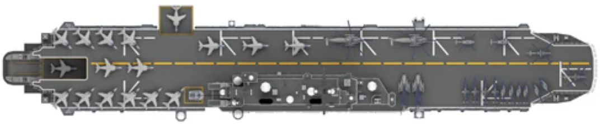

# Battleship AI

A web-based implementation of the classic Battleship board game featuring an AI opponent. Play directly in your browser with no installation required.



## Table of Contents

- [Overview](#overview)
- [Features](#features)
- [Getting Started](#getting-started)
- [How to Play](#how-to-play)
- [Game Rules](#game-rules)
- [Project Structure](#project-structure)
- [Technical Details](#technical-details)
- [Browser Compatibility](#browser-compatibility)
- [Contributing](#contributing)
- [License](#license)

## Overview

Battleship AI brings the classic naval combat strategy game to your web browser. Challenge an AI opponent in a battle of wits as you strategically place your fleet and hunt down enemy ships on a 10x10 grid. The game features an intuitive interface with visual ship placement, real-time fleet status tracking, and animated hit effects.

## Features

**Gameplay**
- Classic 10x10 grid Battleship gameplay
- Manual ship placement with orientation toggle (horizontal/vertical)
- Visual ship placement preview with validity indicators
- Turn-based combat against an AI opponent
- Real-time hit and miss feedback with animated effects

**Fleet Management**
- Five ships of varying sizes: Carrier (5), Battleship (4), Cruiser (3), Submarine (3), Destroyer (2)
- Visual fleet status panels showing damage to each ship
- Ship segment tracking to see exactly where hits have landed
- Toggle visibility of fleet panels

**User Interface**
- Dark ocean-themed design with animated water background
- Grid labels (A-J rows, 1-10 columns) for easy coordinate reference
- Color-coded legend for water, ships, hits, and misses
- Game statistics tracking shots fired by both players
- Status messages guiding you through each phase of the game

**Visual Assets**
- Custom ship sprites for all five vessel types
- Horizontal and vertical ship orientations
- Animated fire effects for successful hits
- Animated ocean background

## Getting Started

### Prerequisites

- A modern web browser (Chrome, Firefox, Safari, Edge)
- No additional software or dependencies required

### Running the Game

**Option 1: Open Directly**

Simply open `index.html` in your web browser by double-clicking the file or dragging it into a browser window.

**Option 2: Local Server**

For the best experience, run a local HTTP server:

```bash
# Navigate to the project directory
cd Battleship-AI

# Start a simple Python server
python3 -m http.server 8000

# Or use Node.js http-server if available
npx http-server -p 8000
```

Then open your browser and navigate to `http://localhost:8000`.

## How to Play

### Phase 1: Ship Placement

1. When the game loads, you'll see two boards: "Your Fleet" on the left and "Enemy Waters" on the right
2. Click on your board to place ships one at a time, starting with the Carrier (size 5)
3. Use the "Orientation" button to toggle between horizontal and vertical placement
4. A green outline shows valid placement positions; a red outline indicates invalid positions
5. Ships cannot overlap or extend beyond the board boundaries
6. Continue placing all five ships: Carrier, Battleship, Cruiser, Submarine, and Destroyer

### Phase 2: Battle

1. Once all ships are placed, click "Start Game" to begin the battle
2. Click on the "Enemy Waters" board to fire at the AI's hidden fleet
3. Hits are shown with animated fire effects; misses appear as gray cells
4. After each shot, the AI will automatically fire back at your fleet
5. The status bar shows whose turn it is and announces when ships are sunk
6. Track remaining ships and shots fired in the statistics panel

### Phase 3: Victory or Defeat

- Sink all five enemy ships to win
- If the AI sinks all your ships first, you lose
- Click "Restart" to play again

## Game Rules

**Board Setup**
- Each player has a 10x10 grid
- Players place 5 ships of different sizes on their grid
- Ships cannot overlap or extend beyond the grid

**Ship Sizes**
| Ship | Size |
|------|------|
| Carrier | 5 cells |
| Battleship | 4 cells |
| Cruiser | 3 cells |
| Submarine | 3 cells |
| Destroyer | 2 cells |

**Gameplay**
- Players take turns firing at opponent's grid
- A "hit" occurs when a shot lands on a ship cell
- A "miss" occurs when a shot lands on empty water
- A ship is "sunk" when all its cells have been hit
- The first player to sink all opponent ships wins

## Project Structure

```
Battleship-AI/
├── index.html          # Main HTML structure and UI layout
├── script.js           # Game logic, AI behavior, and event handling
├── style.css           # Visual styling and animations
├── README.md           # This documentation file
└── images/             # Visual assets
    ├── carrier_*.png   # Carrier ship sprites (4 orientations)
    ├── battleship_*.png# Battleship sprites (4 orientations)
    ├── cruiser_*.png   # Cruiser sprites (4 orientations)
    ├── submarine_*.png # Submarine sprites (4 orientations)
    ├── destroyer_*.png # Destroyer sprites (4 orientations)
    ├── hit_fire.gif    # Animated hit effect
    ├── hit_fire1.png   # Static hit effect
    └── oceans_motion.gif # Animated ocean background
```

## Technical Details

### Architecture

The game is built as a single-page application using vanilla JavaScript, HTML5, and CSS3. No external frameworks or libraries are required.

**Game State Management**

The game maintains state through JavaScript variables including:
- `playerBoard` / `aiBoard`: 10x10 2D arrays representing each grid
- `playerShips` / `aiShips`: Arrays of ship objects with position, damage, and status
- `gameOver`, `playerTurn`, `placementDone`: Flags controlling game flow

**Board Cell Structure**
```javascript
{
  hasShip: boolean,  // True if a ship occupies this cell
  hit: boolean,      // True if this cell has been fired upon
  shipId: number     // Index of the ship in this cell (or null)
}
```

**Ship Object Structure**
```javascript
{
  id: number,        // Unique identifier
  size: number,      // Length in cells (2-5)
  name: string,      // "Carrier", "Battleship", etc.
  hits: number,      // Number of hits taken
  sunk: boolean,     // True when hits >= size
  cells: Array       // [{r, c}] coordinates occupied by ship
}
```

### AI Behavior

The AI opponent uses a random targeting strategy:
1. At game start, all 100 grid coordinates are shuffled
2. Each turn, the AI selects the next coordinate from the shuffled list
3. This ensures no duplicate shots and provides unpredictable gameplay

### Key Functions

| Function | Description |
|----------|-------------|
| `initGame()` | Initializes game state, builds boards, places AI ships |
| `buildBoards()` | Creates DOM elements for both 10x10 grids |
| `placeShipsRandomly()` | Randomly positions AI fleet on the board |
| `onPlayerPlaceShip()` | Handles player ship placement clicks |
| `canPlaceShip()` | Validates ship placement position |
| `startGame()` | Transitions from placement to battle phase |
| `onPlayerFire()` | Processes player attacks on AI board |
| `aiFire()` | Executes AI turn with random targeting |
| `checkAllShipsSunk()` | Determines win/loss conditions |
| `renderFleetPanel()` | Updates fleet status display |

### Styling

The game uses a dark ocean theme with the following color palette:
- Background: `#0b1b2b` (deep navy)
- Text: `#f5f7fa` (off-white)
- Primary button: `#1f8ef1` (bright blue)
- Hit indicator: `#e74c3c` (red)
- Miss indicator: `#95a5a6` (gray)
- Ship/alive: `#27ae60` (green)

## Browser Compatibility

The game is compatible with all modern browsers that support ES6 JavaScript:

- Google Chrome (recommended)
- Mozilla Firefox
- Microsoft Edge
- Safari
- Opera

## Contributing

Contributions are welcome! Here are some ways you can help improve the game:

1. **Report Bugs**: Open an issue describing the bug and steps to reproduce
2. **Suggest Features**: Share ideas for new features or improvements
3. **Submit Pull Requests**: Fork the repository and submit PRs for bug fixes or features

### Development Guidelines

- Follow existing code style and conventions
- Test changes across multiple browsers
- Update documentation for any new features
- Keep commits focused and well-described

## License

This project is open source. Feel free to use, modify, and distribute as needed.

---

Enjoy playing Battleship AI! May your shots be accurate and your fleet remain afloat.
